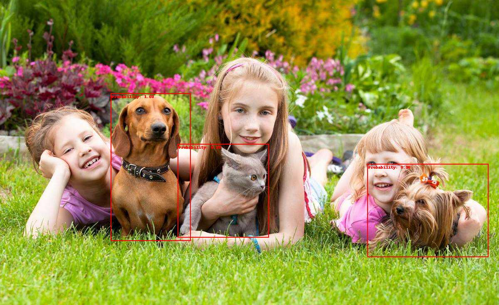

# Продуктовый трек
## 1. Поиск проблемы и описание решения (2 балла)
В этом пункте необходимо сформулировать проблему реального мира и продумать, как именно она будет решаться с помощью вашего продукта. 

### Существующая проблема:
* по всей территории ЖК расставлены камеры видеонаблюдения, сигнал от которых выведен на видео пульт в специальном помещении на экран;
* для мониторинга разных участков дежурный видео пульта вручную последовательно переключает экран на камеры разных участков и визуально контролирует обстановку на территории;
* в каждом подъезде всех зданий ЖК есть консьержи, предназначенные для физического взаимодействия со средой (с людьми и объектам в своей зоне) - это возможность взаимодействия со всей территорией ЖК со стороны оперативных сотрудников управляющей компании (УК);
* УК должна контролировать исполнение запрета (принятого на ОСС собственников) выгула собак на территории ЖК, но не справляется с этим;
* жильцы регулярно находят на территории ЖК собачьи экскременты, от этого портится газон, идёт поток жалоб на работу УК;
* дежурный виде опульта пропускает выгул собак жильцами ЖК и их гостями по причине того, что большую часть времени ничего не происходит, внимание притупляется, мотивация переключаться на камеры "на которых ничего не происходит" снижается;
* консьержи сидят в лобби внутри подъездов и исполняют мелкие поручения жильцов, отслеживать ситуацию вокруг своего подъезда им не позволяет расположение их рабочего места, они не видят всю вверенную территорию;
* если консьерж регулярно покидает подъезд с целью обхода своей территории, это вызывает поток жалоб со стороны жильцов на якобы отсутствующего на рабочем месте консьержа и создаёт предпосылки для злоупотреблений со стороны консьержей (невозможно гарантировать, что консьерж отсутствует из-за наличия дел на территории, а не по причине частых перекуров).

### Целевая аудитория:
* Службы видео мониторинга территорий управляющих компаний ЖКХ и организации, осуществляющие охрану территорий.

### Предлагаемое решение:
* программное обеспечение видео пульта в автоматическом режиме раз в 3 секунды делает снимки со всех камер на территории жк и отправляет для каждого снимка запрос на http-запрос;
* сервис обрабатывает картинку в рамках http-запроса, детектирует наличие на картинке собак и отправляет ответ видео пульту охраны;
* в случае наличия собак или кошек, видео пульт выводит на экран дежурного и консьержа (соответствующего подъезда) индикацию и включает звуковую сигнализацию;
* обязанность консьержа, получившего сигнал, выйти на территорию и вежливо попросить убрать собаку или кошку с территории.

#### Варианты использования сервиса в рамках имеющейся программно-организационной структуры.
##### Сервис (подсистема), разрабатываемая в рамках данного проекта
 
Рисунок 1. Диаграмма использования, разрабатываемого сервиса

##### Уже имеющиеся подсистема видеонаблюдения и варианты её использования с новым функционалом
 
Рисунок 2. Диаграмма использования старой системы видеонаблюдения с новым функционалом

#### Синтаксис API для использования разрабатываемого сервиса:
- авторизоваться в сервисе:
<ul>
    <li>post-запрос <b>http://host:port/login</b></li>
    <li>
        параметры в теле запроса, формат json:
        <pre>
        {
            "login": "dls",
            "password": "dls"
        }
        </pre>
    </li>
</ul>
- получить результаты детектирования в формате графической разметки на исходном изображении:
<ul>
    <li>post-запрос <b>http://host:port/detect_to_jpeg</b></li>
    <li>в качестве параметра запроса передаётся файл картинки из формы (см пример html-формы в исходных кодах)</li>
    <li>в качестве ответа на запрос приходит либо картинка с разметкой детектированных объектов, либо текст json (если детектировать не удалось)</li>
</ul>
- получить результаты детектирования в json-формате:
<ul>
    <li>post-запрос <b>http://host:port/detect_to_jpeg</b></li>
    <li>в качестве параметра запроса передаётся файл картинки из формы (см пример html-формы в исходных кодах)</li>
    <li>
        в качестве ответа на запрос приходит json (ниже пример, для случая удавшегося детектирования):
        <pre>
        {
            "status": "ok",
            "data": {
                "boxes": [
                    [
                        75.01468658447266,
                        292.328369140625,
                        164.70286560058594,
                        544.2100830078125
                    ],
                    [
                        481.8454895019531,
                        363.0608215332031,
                        545.259521484375,
                        473.8014831542969
                    ]
                ],
                "labels": [
                    "dog",
                    "dog"
                ],
                "probabilities": [
                    0.9992601275444031,
                    0.974423348903656
                ]
            }
        }
        </pre>
    </li>
</ul>

## 2. Поиск обученной модели и датасета (1 балл)
Выбрана готовая модель **fasterrcnn_resnet50_fpn_v2** из стандартного пакета torchvision.models.detection с набором весов **FasterRCNN_ResNet50_FPN_V2_Weights.DEFAULT** обученных на датасете **COCO**.

Тестирование показало, что данная модель успешно справляется со своими задачами в сформулированных выше вариантах использования и легко встраивается - этим и обусловлен выбор.

### Примеры результатов работы данной модели в составе разработанного сервиса

Рисунок 3. Пример результата работы модели

Рисунок 4. Пример результата работы модели

Рисунок 5. Пример результата работы модели

Рисунок 6. Пример результата работы модели

Рисунок 7. Пример результата работы модели

Рисунок 8. Пример результата работы модели

Рисунок 9. Пример результата работы модели

## 3. Выбор фреймворка/библиотеки для разработки веб/мобильного демо (0 баллов)

В качестве фреймворка для разработки мобильного демо выбрана библиотека [**AIOHTTP**](https://docs.aiohttp.org) — это асинхронный HTTP-клиент/сервер для модуля [asyncio](https://docs.python.org/3/library/asyncio.html).

## 4. Разработка демо (3 балла)

Исходный код расположен [в репозитории Github по этой ссылке](https://github.com/soedenitel/dls_object_detection).

### Инструкция по запуску сервиса:
- скачать файлы репозитория и разместить их в любой папке на машине, которая будет выполнять роль сервера и на которой настроен интерпретатор Python;
- установить все зависимости, перечисленные в файле requirements.txt;
- перейти в корневую папку, в которой размещены все файлы репозитория (ваша папка из пункта 1);
- запустить серверную часть командой `python start_web_server.py`.

## 5. Встраивание модели-детектора в демо (2 балла)
Модель детектора встроена в рамках репозитория из предыдущего пункта.
### Инструкция по по использованию демо клиентской части:
- после того как запущен сервис (см предыдущий пункт), открыть браузер;
- в адресной строке браузера ввести запрос `http://host:port/` (например, это может быть `http://localhost:8080/`); 
- откроется страница авторизации:

Рисунок 10. Страница авторизации 

- введите Login: `dls`, Password: `dls` и кликните кнопку Login;
- откроется страница с двумя формами:

Рисунок 11. Страница демонстрации работы основных команд сервиса 

- теперь Вы можете продемонстрировать себе и окружающим работу основных команд сервиса: `http://host:port/detect_to_jpeg` и `http://host:port/detect_to_jpeg`.

## 6. Тестирование демо (1 балл)
### Сильная сторона
Основной целью сервиса (в соответствии с постановкой задачи) является **своевременное привлечение внимания персонала** к подотчетной территории. С этим сервис отлично справляется, даже несмотря на имеющие место быть ложно-положительные (False Positive) результаты:

Рисунок 12. Пример ложного срабатывания детектора 

### Слабая сторона
Если задать порог вероятности выше 0.5 для отсечения детекций, то, с одной стороны, это почти исключит ложные срабатывания детектора, но, с другой стороны, сильно возрастут ложные несрабатывания (False Negative) исходы. Например, такая ситуация перестанет детектироваться:

Рисунок 13. Пример ложного несрабатывания детектора, если сделать порог отсечения вероятности больше 0.5 

### Путь для улучшения модели на основе увиденных ошибок:
В силу того, что дежурный видео пульта страдает притуплением внимания из-за того, что большую часть времени ничего не происходит, предлагаю следующее решение:
> - разработать отдельный сервис по графической разметке;
> - детектор будет собирать исходные изображения, у которых детектированы целевые объекты с вероятностью в заданном диапазоне (не ниже и не выше некоторых пороговых значений) и передавать их в сервис из предыдущего пункта;
> - дежурному видео пульта поставить задачу размечать в разработанном сервисе объекты прямоугольниками, которые ему нужны для реагирования;
> - по размеченным изображениям проводить регулярное дообучение модели.

## 7. Улучшение дизайна / Развертывание демо на сервере (1 балл)
Все VPS, дающие бесплатные периоды пользования, требуют регистрации с указанием платёжных данных не из России. Никакие Российские варианты не проходят.

**Готов развернуть на месяц платный VPS** для демонстрации этого проекта, но **по запросу от проверяющего** (чтобы не получилось так, что оплаченный период закончится, а до моего проекта так никто и не доберётся).